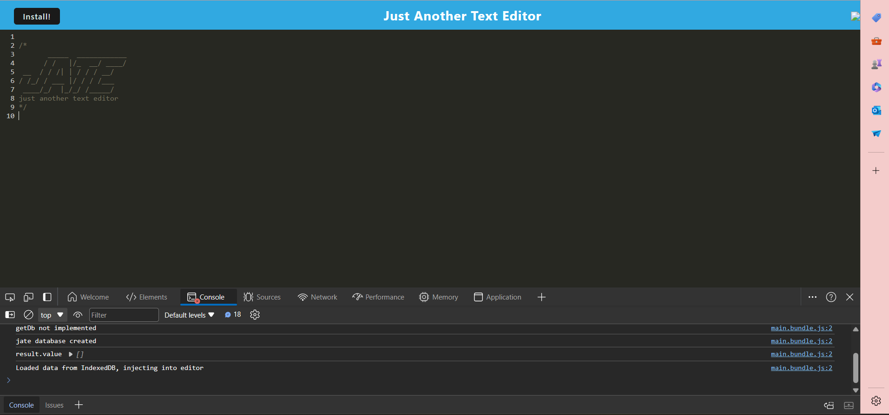

# PWA Text Editor
 
  

## Description

This application works on or offline. It saves customized code snippets for you to use later!

Deployed App: click me!

## Table of Contents

- [Description](#description)
- [Installation](#installation)
- [Usage](#usage)
- [License](#license)
- [Questions](#questions)

## Installation

 npm install and npm start to run the application

## Usage

This application saves snippets of code for later use so you can use it to make work more efficient.

## License

This project is licensed under the MIT license.

## Questions

For questions or feedback regarding this project, please contact me at JoAplon, through my [github](https://github.com/undefined), or my email, jordan0aplon@gmail.com.

